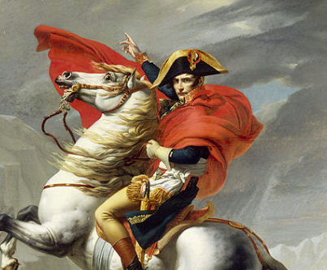
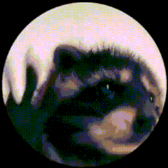

#### King of the Andals, the Rhoynar, and the First Men Lord of the Seven Kingdoms, Protector of the Realm

# KAREEM🌝

"¡Bienvenidos señores! 🎩 I'm Kareem, a software engineer since 2022. Currently, I'm freelancing and dedicating my time to developing and maintaining my own project, the [PALM TREE🌴](https://github.com/RealKareemAnees/PALM-TREE-COMMUNITY-CORE) server. My goal is to create innovative solutions that make a positive impact."

### Find me on

   

---

## Projects:-

## nah

---

# About me:

  <h1 style="margin-right: 1%; color: #4CAF50; font-family: 'Arial Black', sans-serif; font-size: 32px; text-shadow: 2px 2px 4px rgba(0,0,0,0.3);">I don't need to talk about myself, I'm a legend</h1>
  

>

---

# If you need a software engineer for your next project, JITC me on [Upwork](https://www.upwork.com/freelancers/~019cb0f3b40e5e0ba2)

---

  <h1>Thanks for reading, Gentlemen 🎩</h1>
  
  <h1>!Mucho gusto!</h1>

